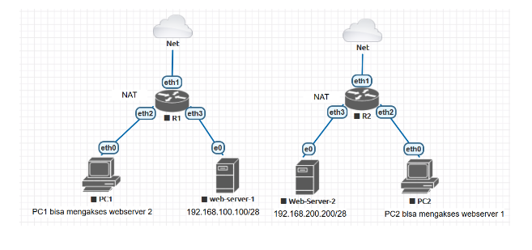

# LAB-26-DST-NAT
tanggal 17 Agustus 2025

seperti yang kita baca, PC1 di jaringan kiri meminta agar bisa   
akses Web Server 2 lewat NAT di Router, dan Begitu sebaliknya.

# Langkah Konfigurasi di Mikrotik
**ROUTER 1**
1. Setting IP di router 1 dan DHCP Client dulu.

       /ip address
       add address=192.168.100.1/28 interface=eth3  
       add address=192.168.10.1/24 interface=eth2

       /ip dhcp-client add interface=eth1 disabled=no use-peer-dns=yes use-peer-ntp=yes add-default-route=yes

2. Setting NAT Masquerade agar bisa akses internet

       /ip firewall nat add chain=srcnat out-interface=eth1 action=masquerade

3. Add DTS NAT agar PC bisa akses WebServer2.

       /ip firewall nat add chain=dstnat in-interface=eth1 protocol=tcp dst-port=80 action=dst-nat to-addresses=192.168.200.200 to-ports=80  

4. Tambahkan juga Filter firewalls forward untuk izin forward ke webserver2

       /ip firewall filter add chain=forward protocol=tcp dst-port=80 dst-address=192.168.200.200 action=accept

**ROUTER 2**
1. Setting IP di router 1 dan DHCP Client dulu.

      /ip address
      add address=192.168.20.1/24 interface=eth2 
      add address=192.168.200.1/28 interface=eth3 

2. Setting NAT Masquerade agar bisa akses internet

    /ip firewall nat add chain=srcnat out-interface=eth1 action=masquerade

3. Add DTS NAT agar PC bisa akses WebServer1.

     /ip firewall nat add chain=dstnat in-interface=eth1 protocol=tcp dst-port=80 action=dst-nat to-addresses=192.168.100.100 to-ports=80

4. Tambahkan juga Filter firewalls forward untuk izin forward ke webserver1

    /ip firewall filter add chain=forward protocol=tcp dst-port=80 dst-address=192.168.100.100 action=accept

# Pengujian
Dari Browser PC1, buka dan ketik
        http://10.10.10.1
Jika berhasil PC1 bisa akses WebServer2 meski alamat aslinya beda network.

PC2, akses http://10.10.10.2, lalu dapat halaman dari WebServer1 (192.168.100.100).

**Keterangan:**

- `dst-address` = alamat publik/interface WAN router yang dituju.
- `dst-port=80` = karena layanan Web Server biasanya di port 80 (HTTP).
- `to-addresses` = IP private server tujuan.
-  `to-ports` = port layanan pada server.
- 
# Kesimpulan
Dengan menggunakan **DST-NAT (PAT)** pada Mikrotik, trafik dari jaringan luar dapat diarahkan       
ke server internal dengan aman. Hal ini memungkinkan server dengan IP private tetap bisa   
diakses dari luar melalui IP publik router, tanpa harus mengubah konfigurasi IP server.   
